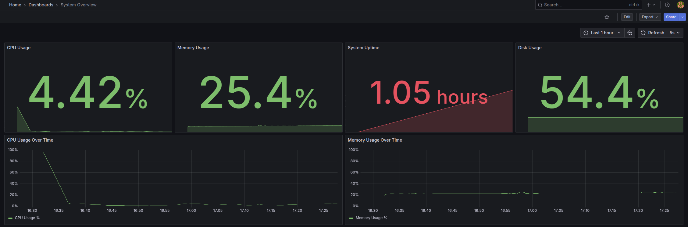
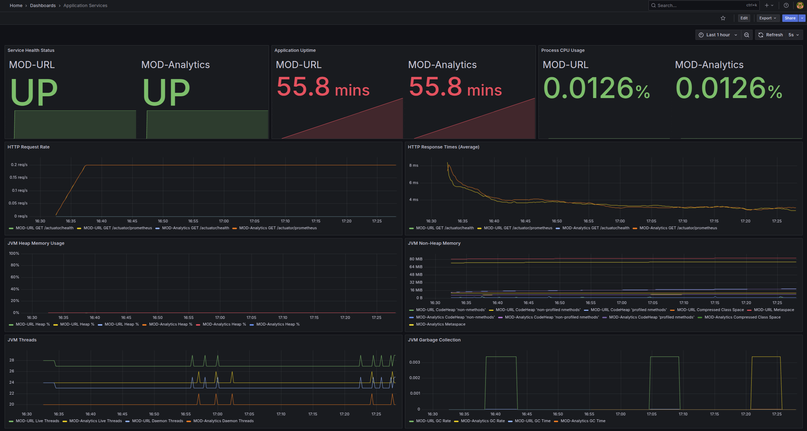
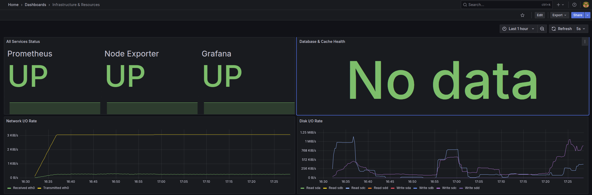
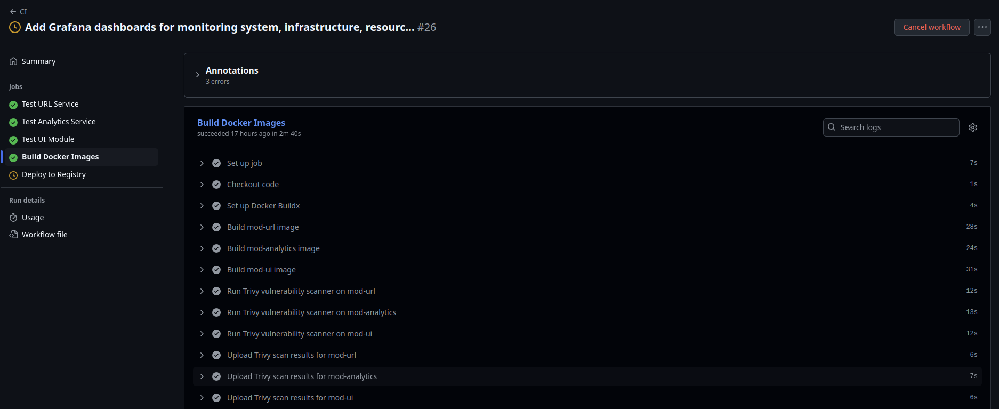
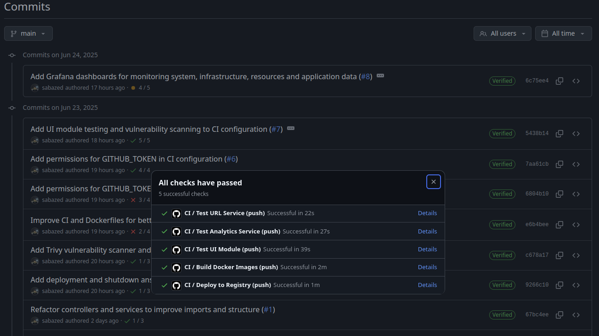
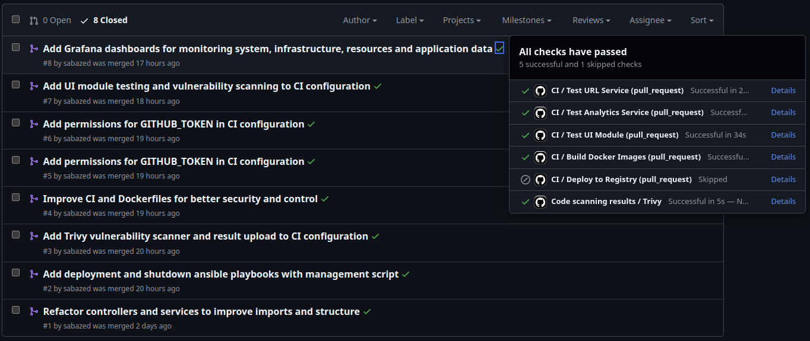
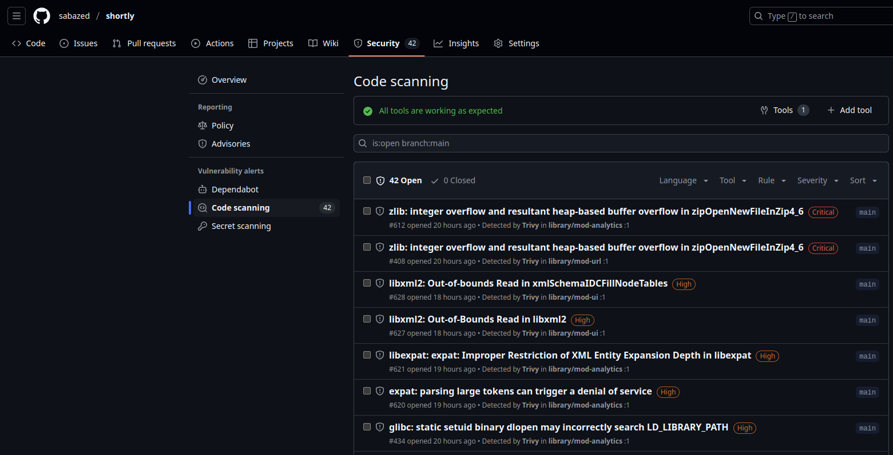

# Shortly - URL Shortener with Monitoring & Analytics

A comprehensive URL shortening service built with microservices architecture, featuring real-time analytics, monitoring, and security scanning.

## 🏗️ Architecture Overview

Shortly consists of the following services:

- **MOD-URL** (Port 8080) - Core URL shortening service
- **MOD-Analytics** (Port 8081) - Analytics and reporting service
- **MOD-UI** (Port 3000) - Frontend web interface
- **PostgreSQL** (Port 5432) - Primary database
- **Redis** (Port 16379) - Caching layer
- **Prometheus** (Port 9090) - Metrics collection
- **Grafana** (Port 3001) - Monitoring dashboards
- **Node Exporter** (Port 9100) - System metrics

## 🚀 Setup Instructions

### Prerequisites

- Docker & Docker Compose
- Java 21+ (for local development)
- Node.js 18+ (for UI development)
- Git

### Quick Start

1. **Clone the repository**
   ```bash
   git clone https://github.com/sabazed/shortly.git
   cd shortly
   ```

2. **Create environment configuration**
   ```bash
   touch .env
   # Edit .env with your specific values
   ```

3. **Build and start all services**
   ```bash
   docker-compose up -d --build
   ```

4. **Verify deployment**
   ```bash
   docker-compose ps
   ```

### Alternative Setup with Ansible

For automated deployment management with Ansible (setup, health checks, and monitoring), follow these steps:

```bash
cd deployment/
chmod +x deploy.sh

# Start all services
./deploy.sh start

# Check status
./deploy.sh status

# Restart services
./deploy.sh restart

# Stop services
./deploy.sh stop
```

### Service URLs

Once running, access the services at:

- **Frontend**: http://localhost:3000
- **URL API**: http://localhost:8080
- **Analytics API**: http://localhost:8081
- **Grafana**: http://localhost:3001 (admin/admin)
- **Prometheus**: http://localhost:9090

## Environment Variables
### .env File Example

```shell
# Database configuration
DB_NAME=shortly
DB_USER=user
DB_PASSWORD=password
# Grafana configuration
GRAFANA_PASSWORD=admin
```

## 🐳 Docker & Containerization

### Docker Compose Architecture

The application uses Docker Compose with the following key features:

- **Health Check Dependencies**: Services wait for dependencies to be healthy before starting
- **Named Volumes**: Persistent data storage for PostgreSQL and Redis
- **Environment Variable Injection**: Secure configuration management via `.env` file
- **Network Isolation**: Services communicate via internal Docker networks
- **Graceful Shutdown**: Proper container lifecycle management

### Docker Images Strategy

Each service uses optimized Docker images:

**Spring Boot Services (MOD-URL, MOD-Analytics)**:
- Multi-stage builds with separate build and runtime stages
- Eclipse Temurin JRE 21 Alpine base for minimal footprint
- Non-root user execution for security
- Built-in health checks via Spring Actuator

**Frontend Service (MOD-UI)**:
- Node.js build stage with production optimizations
- Nginx Alpine runtime for serving static assets
- Minimal attack surface with read-only filesystem

**Infrastructure Services**:
- PostgreSQL 15 Alpine with persistent volumes
- Redis 7 Alpine with AOF persistence
- Prometheus and Grafana latest stable versions

### Container Security

- **Non-root Execution**: All application containers run as unprivileged users
- **Alpine Base Images**: Minimal Linux distribution reduces attack surface
- **No Secrets in Images**: Sensitive data passed via environment variables
- **Health Monitoring**: Comprehensive health checks for all services

## 📊 Service Details

### MOD-URL Service
- **Technology**: Spring Boot, Java 21
- **Purpose**: Core URL shortening functionality
- **Features**: URL creation, redirection, click tracking, custom short codes
- **Monitoring**: Actuator endpoints for health and metrics

### MOD-Analytics Service
- **Technology**: Spring Boot, Java 21
- **Purpose**: Analytics and reporting
- **Features**: Click analytics, geographic data, time-based statistics
- **Monitoring**: JVM and application metrics via Micrometer

### MOD-UI Service
- **Technology**: ReactJs
- **Purpose**: User interface
- **Features**: URL shortening interface, analytics dashboard, responsive design
- **Deployment**: Static build served by Nginx

### Database Layer
- **PostgreSQL**: Primary data storage with health checks
- **Redis**: Caching layer with persistence enabled
- **Volumes**: Named Docker volumes for data persistence

## 🔄 CI/CD Pipeline with GitHub Actions

### Pipeline Overview

The project implements a comprehensive CI/CD pipeline with multiple stages:

**Building Images**:
- Docker builds with testing stages
- Images pushed to GitHub Container Registry (GHCR)
- Post-build container security scanning with Trivy
- Build caching for optimized performance

**Security & Quality Scanning**:
- Trivy vulnerability scanning for filesystem and dependencies
- CodeQL static analysis for Java and JavaScript code
- Security findings in SARIF format automatically uploaded to GitHub Security tab
- Automated blocking of vulnerable builds with CRITICAL issues

**Deployment Controls**:
- Manual approval requirement for production deployments
- GitHub Environments with protection rules
- Automated rollback capabilities

### Manual Approval Workflow

Production deployments require explicit approval:
- Designated approvers must review deployment requests
- Comprehensive deployment summary provided
- Approval tracking and audit trail
- Emergency deployment procedures available

## 📈 Monitoring Implementation

### Prometheus Configuration

Comprehensive metrics collection from:
- Spring Boot applications via Actuator endpoints (`/actuator/prometheus`)
- System metrics via Node Exporter
- Infrastructure services (Grafana, Prometheus self-monitoring)

### Grafana Dashboards

Three purpose-built dashboards:

**System Overview Dashboard**:
- Real-time CPU and memory usage
- System uptime and load indicators
- Disk space utilization

**Application Services Dashboard**:
- HTTP request rates and response times
- JVM metrics including heap memory, thread counts, garbage collection
- Application-specific metrics and uptime
- Error rate tracking and alerting

**Infrastructure & Resources Dashboard**:
- Network interface statistics
- Resource utilization trends
- Network and disk I/O metrics

### Key Metrics Monitored

- **Performance**: HTTP response times, request throughput, error rates
- **Resources**: CPU utilization, memory consumption, disk space
- **Application**: JVM heap usage, garbage collection frequency, thread pools
- **Infrastructure**: Network bandwidth, disk I/O, service availability

## 🔒 Security Implementation

### Application Security
- **Input Validation**: Comprehensive data validation and sanitization
- **Environment Configuration**: Externalized secrets via environment variables
- **Network Segmentation**: Service isolation via Docker networks

### Infrastructure Security
- **Container Isolation**: Non-privileged container execution
- **Port Management**: Internal services not exposed to external networks
- **Secret Management**: Database credentials managed via environment variables

### CI/CD Security
- **Automated Scanning**: Multi-layered security scanning in pipeline
- **Approval Controls**: Manual approval gates for production deployments
- **Audit Trail**: Complete deployment history and approval tracking

## 📸 Screenshots

### System Overview Dashboard

*Real-time system metrics showing CPU, memory, uptime, and service status*
system
### Application Metrics Dashboard

*JVM metrics, HTTP request rates, response times, and garbage collection data*

### Infrastructure Dashboard

*Network I/O, disk usage, and database connectivity status*

### CI/CD Pipeline



*Complete CI/CD pipeline with security scanning, testing, and deployment approval*

### Security Scan Results

*Trivy and CodeQL security analysis results with vulnerability assessment*

## 🛠️ Development

### Local Development Setup

1. **Start infrastructure services**
   ```bash
   docker-compose up -d postgres redis
   ```

2. **Run application services locally**
   ```bash
   # Terminal 1 - MOD-URL
   cd mod-url && mvn spring-boot:run

   # Terminal 2 - MOD-Analytics  
   cd mod-analytics && mvn spring-boot:run

   # Terminal 3 - MOD-UI
   cd mod-ui && npm install && npm start
   ```

### Testing

```bash
# Health verification
curl http://localhost:8080/actuator/health
curl http://localhost:8081/actuator/health

# Metrics inspection
curl http://localhost:8080/actuator/prometheus
```

## Additional Resources

- [Incident simulation with post-mortem report](https://docs.spring.io/spring-boot/docs/current/reference/htmlsingle/)
- [Trivy vulnerability scanning and resolution](https://reactjs.org/docs/getting-started.html)