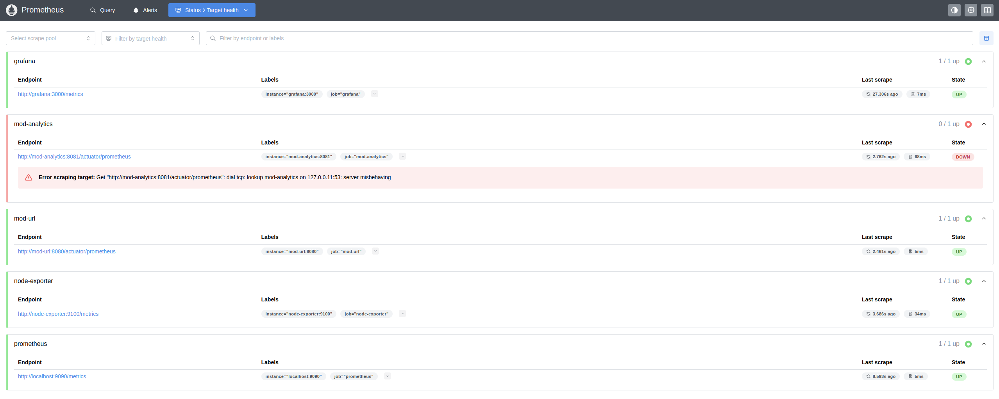
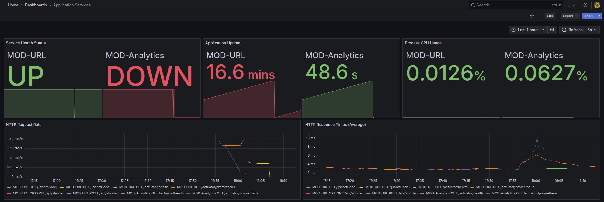
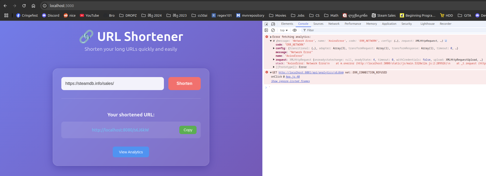
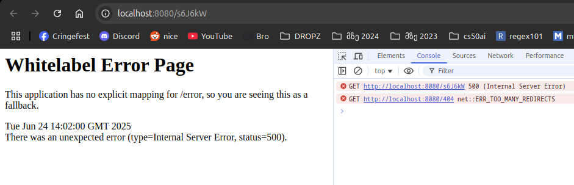
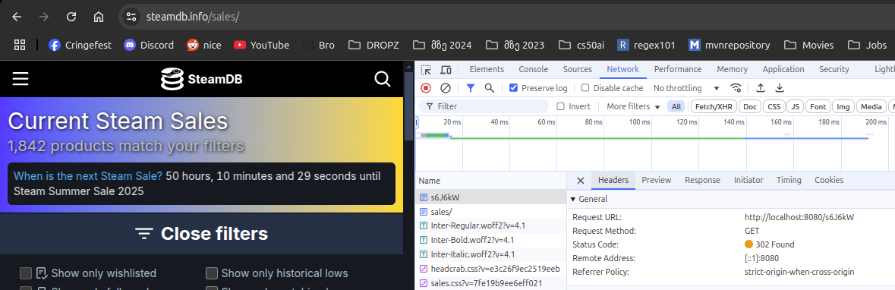

# Post-Mortem Report: MOD-Analytics Service Failure

## Summary

During a planned service failure simulation, the MOD-Analytics service was intentionally killed to test system resilience. The failure exposed a critical architectural flaw where the analytics service outage completely broke core URL redirection functionality, rendering all shortened URLs inaccessible to users.

**Key Finding**: Synchronous dependency on analytics service caused complete service interruption, rather than allowing disabling non-essential features gracefully.

## Impact

### User Impact
- **Severity**: High
- **Affected Users**: 100% of users attempting to access shortened URLs
- **Service Degradation**: Complete failure of URL redirection
- **Duration**: 15 minutes

### Business Impact
- Core product functionality unavailable
- All shortened links returned errors instead of redirecting
- Analytics dashboard showed console errors (non-blocking)
- No data loss occurred

### Technical Impact
- MOD-URL service threw exceptions on every redirection attempt
- Analytics data collection stopped (expected)
- Monitoring systems correctly detected failure
- Frontend analytics features gracefully degraded

## Timeline

| Time (UTC) | Event                                                            | Evidence               |
|------------|------------------------------------------------------------------|------------------------|
| 14:00:00   | **Incident Start**: Executed `docker compose kill mod-analytics` | Command execution      |
| 14:00:05   | Prometheus marked analytics service as DOWN                      | Screenshot 1           |
| 14:00:10   | Grafana dashboard showed missing analytics metrics               | Screenshot 2           |
| 14:01:00   | Attempted to access shortened URL for testing                    | Manual testing         |
| 14:01:02   | **Critical**: URL redirection failed with timeout exception      | Application logs       |
| 14:01:05   | MOD-UI analytics page showed console errors                      | Screenshot 3           |
| 14:05:00   | Root cause identified: synchronous analytics dependency          | Code analysis          |
| 14:15:00   | **Incident End**: Analytics service manually restarted           | `docker compose up -d` |
| 14:15:30   | All functionality restored to normal                             | Service verification   |

## Incident Evidence

### Step 1: Service Failure Simulation
```bash
saba@saba-MS-7D54:~/IdeaProjects/shortly$ docker compose kill mod-analytics
[+] Killing 1/1
 ✔ Container shortly-mod-analytics-1  Killed   
```

### Step 2: Monitoring Detection

*Prometheus immediately detected MOD-Analytics as unreachable and marked it DOWN*


*Grafana Application Services Dashboard showing missing metrics for MOD-Analytics service*

### Step 3: User Impact Observation

*MOD-UI analytics page showing console errors when trying to fetch analytics data*

### Step 4: Critical Failure Discovery
**Application Logs** (MOD-URL service):
```
mod-url-1  | 2025-06-24T14:01:55.609Z ERROR 1 --- [url-service] [nio-8080-exec-2] o.a.c.c.C.[.[.[/].[dispatcherServlet]    : Servlet.service() for servlet [dispatcherServlet] in context with path [] threw exception [Request processing failed: org.springframework.web.client.ResourceAccessException: I/O error on POST request for "http://mod-analytics:8081/api/analytics/click": mod-analytics] with root cause
mod-url-1  | 
mod-url-1  | java.net.UnknownHostException: mod-analytics
mod-url-1  |    at java.base/sun.nio.ch.NioSocketImpl.connect(Unknown Source) ~[na:na]
mod-url-1  |    at java.base/java.net.Socket.connect(Unknown Source) ~[na:na]
mod-url-1  |    at java.base/java.net.Socket.connect(Unknown Source) ~[na:na]
```

**User Experience**:


### Step 5: Service Recovery
```bash
saba@saba-MS-7D54:~/IdeaProjects/shortly$ docker compose up -d mod-analytics
[+] Running 2/2
 ✔ Container shortly-postgres-1       Healthy                                                                                                                                                                                                                                                                    0.5s 
 ✔ Container shortly-mod-analytics-1  Started 
```

## Root Cause

**Primary Cause**: MOD-URL service makes synchronous HTTP calls to MOD-Analytics during URL redirection flow.

**Technical Details**:
When a user accesses a shortened URL, MOD-URL:
1. Retrieves original URL from database
2. Makes blocking HTTP call to analytics service
3. If analytics call fails → throws exception → redirection never occurs

**Problematic Code Flow**:
```java
  @GetMapping("/{shortCode}")
public RedirectView redirectToOriginalUrl(@PathVariable String shortCode) {
  String originalUrl = urlService.getOriginalUrl(shortCode);

  if (originalUrl != null) {
    
    // BLOCKING call - if this fails, everything fails
    restTemplate.postForLocation(analyticsUrl + ANALYTICS_ENDPOINT, Map.of("shortCode", shortCode));
    
    return new RedirectView(originalUrl);
  } else {
    return new RedirectView("/404");
  }
}
```

**Contributing Factors**:
- No circuit breaker pattern implemented
- Tight coupling between core and auxiliary services
- Missing container auto-restart policies
- Lack of async processing for non-critical operations

## Resolution

### Immediate Resolution
```bash
docker compose up -d mod-analytics
```

**Recovery Evidence**:

*Redirecting to original URL after analytics service restart*

**Verification Steps**:
1. Tested shortened URL access (successful)
2. Verified analytics data collection resumed
3. Confirmed monitoring dashboards returned to normal
4. Validated no impact on other services

### Resolution Verification
```bash
# Health check confirmation
saba@saba-MS-7D54:~/IdeaProjects/shortly$ curl http://localhost:8081/actuator/health
{"status":"UP","components":{"db":{"status":"UP","details":{"database":"PostgreSQL","validationQuery":"isValid()"}},"diskSpace":{"status":"UP","details":{"total":490577010688,"free":223234695168,"threshold":10485760,"path":"/app/.","exists":true}},"ping":{"status":"UP"},"ssl":{"status":"UP","details":{"validChains":[],"invalidChains":[]}}}}

# Functionality test
saba@saba-MS-7D54:~/IdeaProjects/shortly$ curl -I http://localhost:8080/s6J6kW
HTTP/1.1 302 
Vary: Origin
Vary: Access-Control-Request-Method
Vary: Access-Control-Request-Headers
Location: https://steamdb.info/sales/
Content-Language: en
Date: Tue, 24 Jun 2025 14:52:39 GMT

```

## Lessons Learned

### What Went Well
- **Monitoring Excellence**: Prometheus detected failure within 5 seconds
- **Dashboard Visibility**: Grafana clearly showed service unavailability
- **Rapid Diagnosis**: Root cause identified quickly through systematic testing
- **Clean Recovery**: No critical data loss or corruption during incident

### What Went Poorly
- **Critical Dependency**: Analytics failure broke core functionality
- **No Graceful Degradation**: Complete service failure instead of feature degradation
- **Synchronous Architecture**: Blocking calls in critical user path
- **Missing Resilience Patterns**: No circuit breakers or fallback mechanisms
- **No Auto-Recovery**: Manual intervention required for service restart

### Key Insights
1. **Auxiliary services should never block core functionality**
2. **Async patterns essential for non-critical operations**
3. **Monitoring systems work excellently for detection**
4. **Service dependencies need careful architectural consideration**
5. **Container orchestration needs better failure recovery**

## Action Items

### Immediate
- **HIGH**: Implement asynchronous analytics calls in MOD-URL
  - **Success Criteria**: Analytics failure doesn't impact redirection
  - **Code Change**: Make analytics calls non-blocking using @Async annotation

- **HIGH**: Add container restart policies to docker-compose.yml
  - **Success Criteria**: Failed containers auto-restart
  - **Config**: `restart: unless-stopped` for all services

### Short Term
- **MEDIUM**: Implement circuit breaker pattern for analytics service
  - **Success Criteria**: Graceful fallback when analytics unavailable
  - **Library**: Spring Cloud Circuit Breaker

- **MEDIUM**: Create integration tests for service failure scenarios
  - **Success Criteria**: Automated tests validate resilience
  - **Framework**: Testcontainers for failure simulation

### Long Term
- **LOW**: Migrate to event-driven architecture for analytics
  - **Success Criteria**: Complete decoupling of analytics from core flow
  - **Technology**: Kafka for event streaming